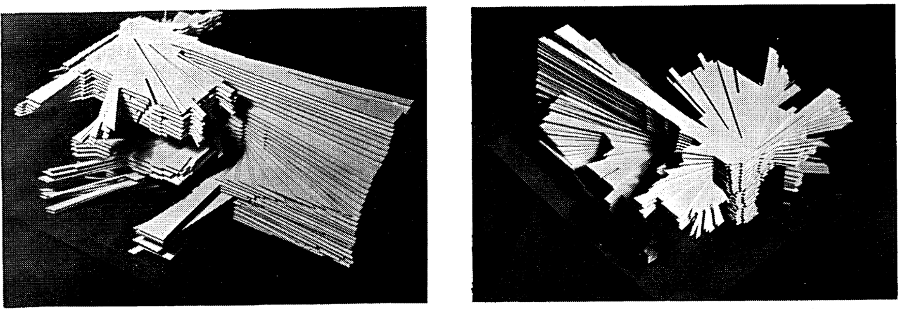

# Documentation Bassins de lumière 

 

Dispositif d’exploration spatio-temporelle des bassins de visibilité.  
Une interaction gestuelle permet à l’utilisateur de se déplacer visuellement au sein de cette fossilisation d’une promenade, pour en redécouvrir la temporalité et la spatialité.

## Ecosystème Bassins de lumière
- [`bassins-de-lumiere`]() : Bassins de lumière main app
- `bassins-de-lumiere-documentation` : Bassins de lumière hardware, hookup & misc guides

## Développement
Environnement :  
Langage :

## Matériel
- Raspberry Pi
- x5 micro-contrôleurs `ESP32`
- x1 ` `
- x1 ` `
- x10 matrice LED flexible `WS2812B (16x16 Pixel)`  
- Power supply 5V 80A `UHP-500-5` refroidissement passif
- Tablette

## Câblage
  

## Connectique
RaspberryPi en tête qui connecte les 5 micro-contrôleur en USB. On vient alors parler en RJ45 au RPi qui dispatch sur les micro-contrôleurs. RaspberryPi en hôte de l'animation et en serveur, configuré en AP Wifi.

## Inspirations et objets de recherche
 

Benedikt, M L. 1979. “To Take Hold of Space: Isovists and Isovist Fields.”  
Environment and Planning B: Planning and Design 6 (1): 47–65.  
Travaux à l'Université du Texas, relatifs à un modèle de Minkowski de champ d'isovists.
  
 
 
 

Teller, Jacques, and S. Azar. 2001. “Townscope II—A Computer System to Support Solar Access Decision-Making.”  
Solar Energy 70 (3): 187–200.  
Travaux à l'Université de Liège relatifs aux projections sphériques et cartes de vues du
ciel.
  
 
 
 

Extrait de : Sarradin, F. 2004. Analyse morphologique des espaces ouverts urbains le long de parcours.  
AAU-CERMA, ENSA Nantes.
Squelettisation d’une carte de vue du ciel, cours des 50 otages, Nantes.
  
 
 
  
Parcours à Nantes 2km

## Objet

## Interface
  

## Visualisation
  

